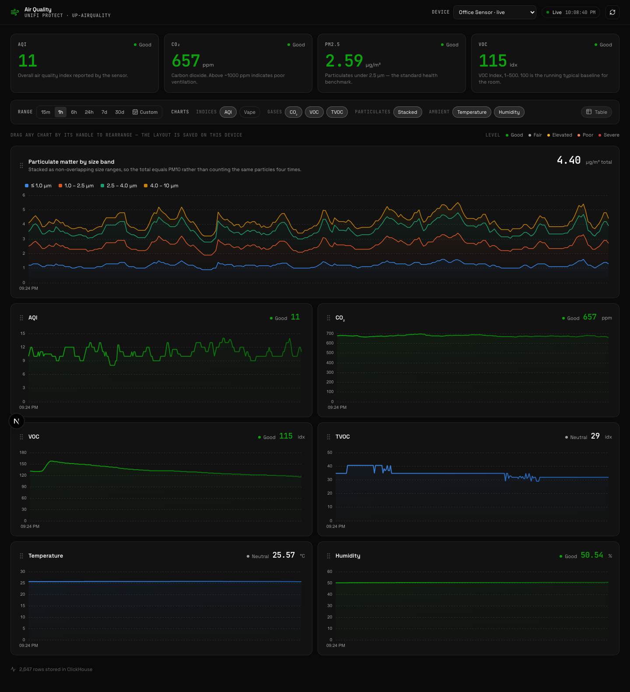
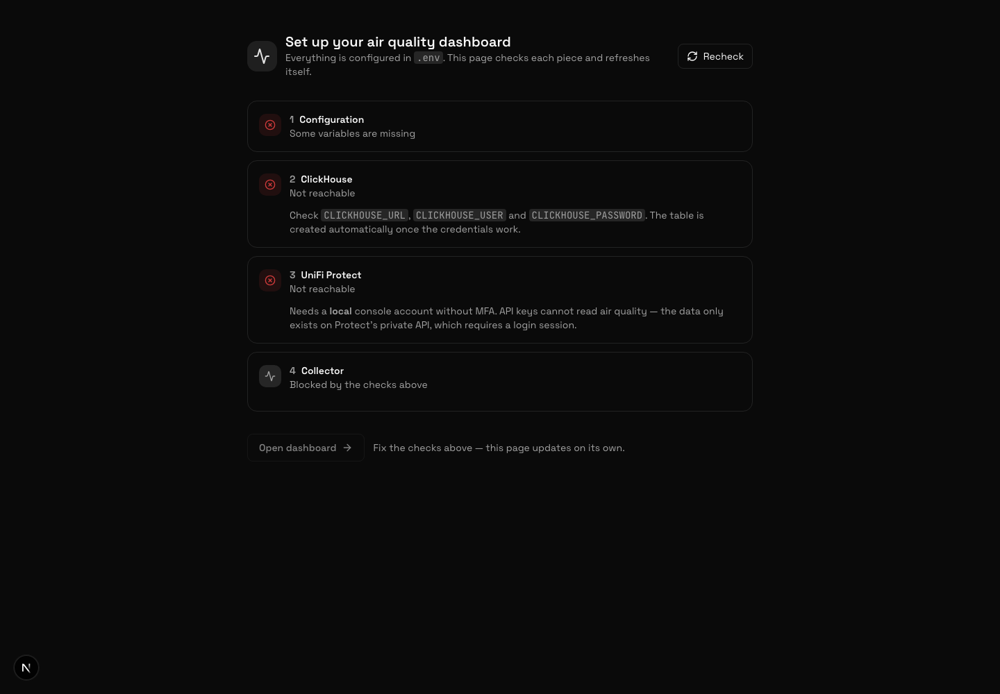
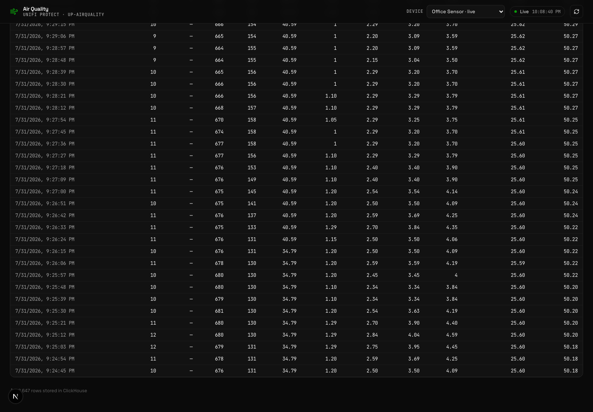
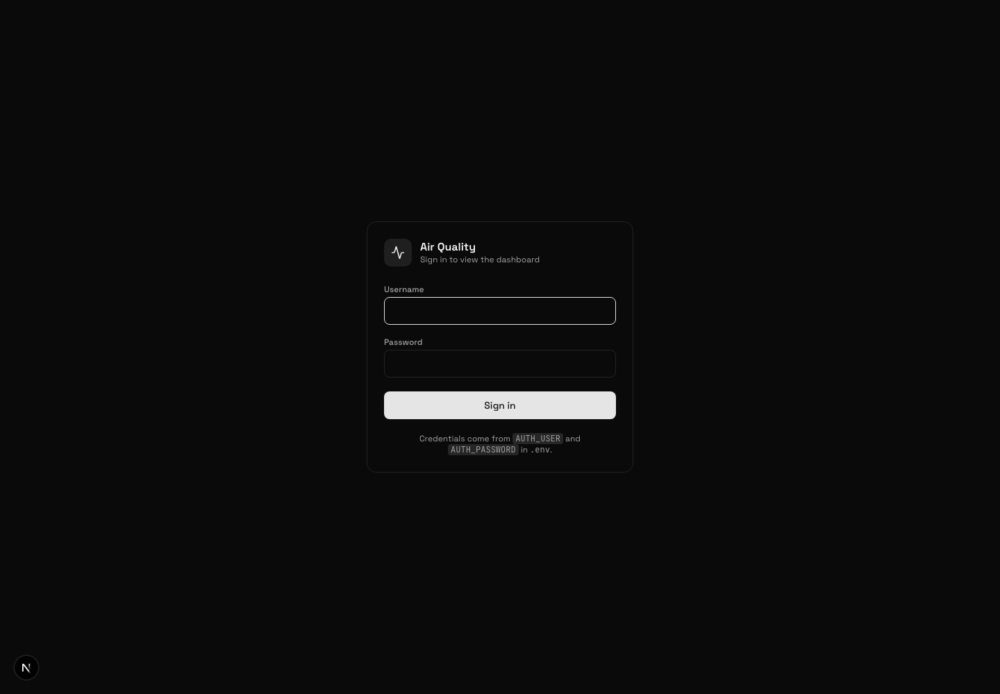

# UniFi Protect Air Quality Dashboard

[](https://github.com/bsidio/unifi-protect-airquality-dashboard/actions/workflows/ci.yml)
[](LICENSE)

Realtime dashboard for the **UniFi UP-AirQuality** (Vape Detection & Air Quality Sensor),
storing every reading in ClickHouse.

Next.js app + a collector that holds one WebSocket open to your Protect console and
writes readings as they arrive (~1 Hz).



<details>
<summary>More screenshots</summary>

**Onboarding** — checks config, ClickHouse, Protect, and the collector, refreshing itself
until everything is green.



**Table view** — the same numbers without relying on colour.



**Login** — only shown when `AUTH_ENABLED=true`.



</details>

## Features

- Live readings over a single WebSocket (~1 Hz), no polling
- Full history in ClickHouse, one table, queryable however you like
- Severity levels from published standards, with the source named in the UI
- Particulates stacked as **size bands**, so the total is PM10 rather than four-times-counted
- Drag-and-drop chart layout, saved per browser
- Relative ranges (15m → 30d) or an absolute calendar range
- Public dashboard, or single-account login — one env var
- Onboarding page that diagnoses a broken install

## Why this needs a login, not an API key

The endpoint you would expect to use does not work:

| Route | Result |
|---|---|
| `GET /proxy/protect/integration/v1/sensors/{id}` + API key | No air quality. The public sensor schema stops at `light` / `humidity` / `temperature`, all `null` on a UP-AirQuality |
| `wss://…/integration/v1/subscribe/devices` + API key | Connects, then stays silent — the public schema has no `airQuality` field to push |
| The sensor itself, on `:8080` | ESP32, SSH disabled, one auth-gated `POST /api/info`. Telemetry leaves over `ucp4`, a proprietary binary protocol — not REST |
| Protect backend ports `:7443` / `:7444` | `302` back through the same nginx proxy. No auth bypass |
| **`GET /proxy/protect/api/bootstrap` + session cookie** | ✅ `sensors[].airQuality` |
| **`wss://…/proxy/protect/ws/updates` + session cookie** | ✅ live pushes |

The private API rejects API keys (`500` on `X-API-KEY`, `401` on `Bearer`), and there is
no `api-key-login` route to trade a key for a session. So the collector logs in with a
username and password, exactly as the browser does. See
[uiprotect#1007](https://github.com/uilibs/uiprotect/issues/1007).

Frames on that socket are undocumented: a run of 8-byte headers
(`type, format, deflated, _, uint32 size`), each followed by an optionally
zlib-deflated payload. Packet 1 is the action, packet 2 the data. Pushes can be
partial, so `lib/protect.ts` merges them onto the last full reading.

## Setup

```bash
cp .env.example .env     # fill it in
npm install
npm run dev              # http://localhost:3000
```

Visit `/onboarding` — it checks config, ClickHouse, Protect, and the collector, and
refreshes itself until everything is green.

The `readings` table is created automatically on first run.

### Requirements

- A **local** UniFi OS account **without MFA** (MFA breaks unattended reconnects).
  A dedicated read-only account is the sane choice.
- ClickHouse reachable from the app.

## Configuration

Everything lives in `.env`. Changing it requires a server restart — the auth
middleware compiles its env in.

| Variable | Meaning |
|---|---|
| `APP_NAME` | Site name in the header and browser tab |
| `UNIFI_HOST` | Console address, e.g. `192.168.1.1` |
| `UNIFI_USER` / `UNIFI_PASS` | Local console account |
| `UNIFI_VERIFY_SSL` | `0` unless the console has a real certificate |
| `CLICKHOUSE_URL` / `_DB` / `_USER` / `_PASSWORD` | Database connection |
| `AUTH_ENABLED` | `false` = public dashboard, `true` = login required |
| `AUTH_USER` / `AUTH_PASSWORD` | The single account used when auth is on |
| `APP_SECRET` | Session signing key — `openssl rand -hex 32` |
| `COLLECTOR_ENABLED` | Set `false` to run the UI without ingesting |
| `COLLECTOR_FLUSH_MS` | Batch insert interval |
| `COLLECTOR_DEDUPE` | Only write a metric when its value changes |

Auth is a signed cookie (HMAC-SHA256, Web Crypto). No session store, no users table.

## Storage

One table — sensor data only. Devices for the picker are derived from it.

```sql
CREATE TABLE readings (
  ts DateTime64(3,'UTC'), console LowCardinality(String),
  sensor_id LowCardinality(String), sensor_name LowCardinality(String),
  metric LowCardinality(String), value Float64, status LowCardinality(String)
) ENGINE = MergeTree
PARTITION BY toYYYYMM(ts) ORDER BY (sensor_id, metric, ts)
TTL toDateTime(ts) + INTERVAL 24 MONTH
```

**Dedupe changes what row counts mean.** With `COLLECTOR_DEDUPE=true` a metric is
written only when it changes, so TVOC (few distinct values) has far fewer rows than
VOC (many) — that is not data loss. Because of this, `/api/series` carries the last
known value forward across empty buckets; without it the charts would render as
dotted fragments and any average would skew toward whichever metric churns most.

## Metrics, units, and levels

Units come from the [UP-AirQuality tech specs](https://techspecs.ui.com/unifi/physical-security/up-airquality).
Note **VOC and TVOC are indices (`idx`), not ppb.**

| Metric | Unit | Sensor range | Level source |
|---|---|---|---|
| AQI | — | 0–500 | US EPA AQI categories |
| Vape | — | 0–100 | Device's own `vapeSettings` alert threshold (50) |
| CO₂ | ppm | 0–40,000 | ASHRAE / common IAQ guidance |
| VOC | idx | 1–500 | Sensirion VOC Index (100 = room baseline) |
| TVOC | idx | — | **No published bands** — falls back to UniFi's own status word |
| PM1.0 | µg/m³ | 0–1000 | No PM1 standard; PM2.5 bands as a proxy |
| PM2.5 | µg/m³ | 0–1000 | US EPA 24-hour breakpoints |
| PM4.0 | µg/m³ | 0–1000 | No PM4 standard; PM10 bands as a proxy |
| PM10 | µg/m³ | 0–1000 | US EPA 24-hour breakpoints |
| Temperature | °C | 0–40 | **Not graded** — comfort is a preference, not an air-quality level |
| Humidity | % RH | 0–90 | EPA / ASHRAE indoor guidance |

UniFi's `airQualitySettings` only carries user-configurable *alert* thresholds (null
until you set them), so severity bands come from the public standards above rather
than from the device. Every colour is paired with its word (Good / Fair / Elevated /
Poor / Severe), and hovering a level shows which standard produced it — colour never
carries the meaning alone. Metrics without a defensible band say so and defer to the
sensor.

### Particulates are stacked as size bands

PM readings are cumulative — PM10 already contains PM2.5, which contains PM1.0.
Stacking the raw values would count the same particles up to four times. The stacked
chart plots the band *between* adjacent cuts (≤1.0, 1.0–2.5, 2.5–4.0, 4.0–10), so the
total equals PM10 and each band is an honest mass-in-this-size-range.

## Layout

Charts are draggable; order, metric selection, range, and device are saved to
`localStorage` per browser. "Reset layout" restores the default.

Metrics live on very different scales (CO₂ ~700 ppm beside PM2.5 ~3 µg/m³), so they
render as small multiples — one chart, one axis — rather than sharing a second y-axis.

## API

| Route | Purpose |
|---|---|
| `GET /api/health` | Config, ClickHouse, Protect, collector — powers onboarding |
| `GET /api/devices` | Sensors seen in ClickHouse, merged with live ones |
| `GET /api/latest?sensor=` | Freshest reading (in-process, else ClickHouse) |
| `GET /api/series?sensor=&metrics=&range=` or `&from=&to=` | Bucketed history |
| `GET /api/live` | SSE stream of readings |
| `POST /api/auth/login` · `/logout` | Session cookie |

## tools/ — standalone Python

The original prototype, still useful for debugging without the web app:

```bash
pip install -r tools/requirements.txt
python3 tools/stream.py --once   # one snapshot
python3 tools/stream.py          # live stream
python3 tools/server.py          # minimal local dashboard, no ClickHouse
```

It reads the same root `.env`.

## Contribute to openaqi (optional)

Your sensor is measuring air quality in a place official monitoring almost
certainly does not cover — often the nearest reference station is the only one
for the whole city. [openaqi.net](https://openaqi.net) is a free public map
built from readings like these.

Set one variable and this dashboard forwards its readings there once a minute:

```bash
# Register a station at https://openaqi.net/account — approximate
# coordinates are fine, and they are never published.
OPENAQI_KEY=oaq_your_station_key
```

That is the whole integration. No key, no forwarding.

**What is sent.** Timestamps, metric names and numbers. Nothing else.

```json
{ "readings": [ { "ts": "2026-08-02T20:03:25.185Z", "metric": "pm2p5", "value": 9.1 } ] }
```

Not your coordinates — openaqi resolves location from the station you
registered, server-side, to an area of about 5 km². Not your sensor's name
either: this dashboard knows it as "Bedroom"; openaqi never learns that. Its
readings table has no column for either.

Check rather than trust:

```bash
OPENAQI_DRY_RUN=true   # logs the exact payload and sends nothing
```

**What it will not do.** Forwarding runs on its own timer with its own buffer,
so openaqi being slow, down or misconfigured cannot delay or lose a local
write — your ClickHouse is always written first. A network failure keeps the
readings and retries with backoff. A rejected key stops immediately with a
message rather than retrying forever, and `vape` is filtered out because
openaqi's catalogue does not include it.

Status appears in `/api/health` under `openaqi` — counters and the last error,
never the key.

## Contributing

Issues and pull requests are welcome — see [CONTRIBUTING.md](CONTRIBUTING.md).

Two things worth reading before changing anything important: `lib/protect.ts`
decodes an **undocumented** protocol that Ubiquiti can change in any release, and
`lib/metrics.ts` deliberately leaves thresholds off metrics that have no published
bands rather than inventing numbers.

## Acknowledgements

- Chart components from [EvilCharts](https://evilcharts.com) (ECharts engine), installed
  via the shadcn registry and vendored under `components/evilcharts/`.
- [uiprotect#1007](https://github.com/uilibs/uiprotect/issues/1007) documented the gap in
  the public integration API.
- [UPAQ-MQTT](https://github.com/Tommo-101/UPAQ-MQTT) showed that the private WebSocket
  was the practical route to this data.

## Disclaimer

Not affiliated with, endorsed by, or supported by Ubiquiti. "UniFi" and "UniFi Protect"
are trademarks of Ubiquiti Inc.

This talks to a **private, undocumented** API using your console credentials. It reads
only; it never writes to your Protect install. A Protect update can break it without
warning. Use a dedicated, least-privilege local account.

## License

[MIT](LICENSE)
